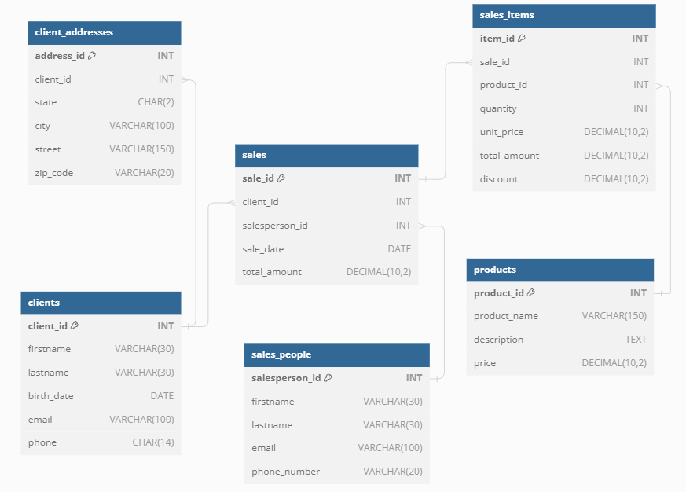
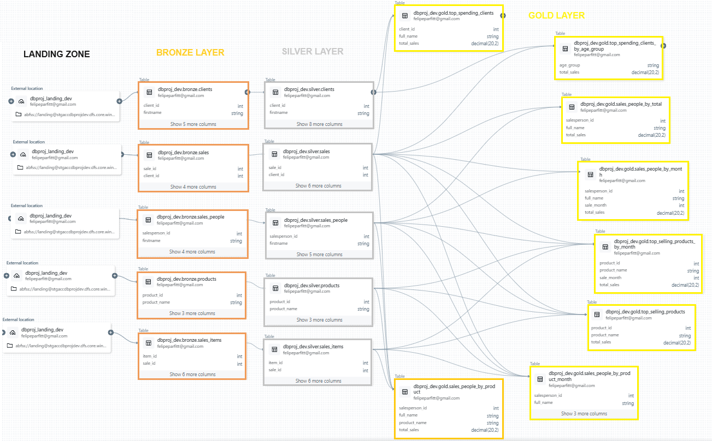

# Azure Databricks ETL Pipeline: Batch and Streaming Data Management for Sales Analytics with Unity Catalog and Azure DevOps

## Project Objective

The objective of this project is to design and implement an automated and reusable ETL pipeline within Azure Databricks, integrating batch and streaming processes for efficient data management. Utilizing Unity Catalog for data governance and Azure DevOps for CI/CD, the pipeline encompasses data extraction, transformation, and loading to facilitate timely access to clean, structured data. This setup supports comprehensive data analysis and business intelligence by ensuring data integrity, consistency, and accessibility across different stages of processing.

## Project Assumptions

For the development of the project, the following assumptions were made:
+ **Data Creation:** The data source is generated by a Python script and saved as CSV files in the landing zone of ADLS storage.
+ **Technology Stack:** Azure Databricks for data processing, Unity Catalog for data governance, ADLS for storage, and Azure DevOps for CI/CD.
+ **Data Processing:** Includes both batch and streaming data with specific schemas.
+ **Medallion Architecture:** Utilizes bronze, silver, and gold layers for efficient data processing and management (delta format).

## Technologies Used in the Project

+ [Azure Databricks](https://azure.microsoft.com/en-us/products/databricks/): For processing and orchestrating ETL workflows.
+ [Azure Data Lake Storage (ADLS)](https://azure.microsoft.com/en-us/products/storage/data-lake-storage/): Provides scalable and secure data storage.
+ [Azure DevOps](https://azure.microsoft.com/en-us/products/devops/): Automates CI/CD pipelines for seamless deployment.

## Motivations for Using Each Technology

+ **Azure Databricks:** Provides Spark for large-scale data processing and supports data ingestion from various sources. It simplifies ETL workflows and enables efficient data transformations.

+ **Azure Data Lake Storage (ADLS):** Offers scalable and secure storage for data lakes. It stores raw and transformed data efficiently, supporting the project's bronze, silver, and gold layers.

+ **Azure DevOps:** Manages CI/CD pipelines with repositories and automation tools. It streamlines the deployment and integration of the project, ensuring continuous updates and testing.

## Instructions for Execution

1) **Create a Pull Request:** Merge your feature branch into the main branch to trigger the CI pipeline.
2) **Pipeline Runs:** The pipeline runs automatically when changes are pushed to the main branch.
3) **Deployment Process:** The pipeline authenticates with Azure, manages Databricks resources, and deploys notebooks from the notebooks folder to the Databricks workspace.

## Configurations

Configuration variables are securely managed, including Azure credentials and storage settings.

- **Azure DevOps Variables:**
  - *dev-env-name*: The name of the development environment.
  - *dev-resource-grp-name*: The name of the resource group in Azure.
  - *dev-service-connection-name*: The service connection name for Azure authentication.
  - *notebookPath*: Path to the notebooks folder, default is "notebooks".

## Project Architectures
The data source consists of five tables: clients, client_addresses, sales_people, sales, sales_items, and products. The image below illustrates the relationships between these tables.

The project involves defined schemas for both batch (products, sales_people) and streaming data (clients, client_addresses, sales, sales_items). The ETL workflow processes this data through bronze, silver, and gold layers, ensuring comprehensive data transformation and availability. The relationships and data flow between these tables are illustrated in the data lineage diagram below.

## Data Transformation Queries

+ **Sales People by Total:** Aggregates total sales per salesperson.
+ **Sales People by Month:** Aggregates sales data by salesperson and month.
+ **Sales People by Product:** Shows sales totals per salesperson and product.
+ **Sales People by Product and Month:** Displays sales data by salesperson, product, and month.
+ **Top Selling Products:** Identifies products with the highest sales.
+ **Top Selling Products by Month:** Shows top-selling products for each month.
+ **Top Spending Clients:** Highlights clients with the highest spending.
+ **Top Spending Clients by Age Group:** Aggregates spending by client age group.

## Possible Project Enhancements

- Add data quality checks and validation steps.
- Implement data lineage tracking and enhance monitoring capabilities.